## 一、双编码器

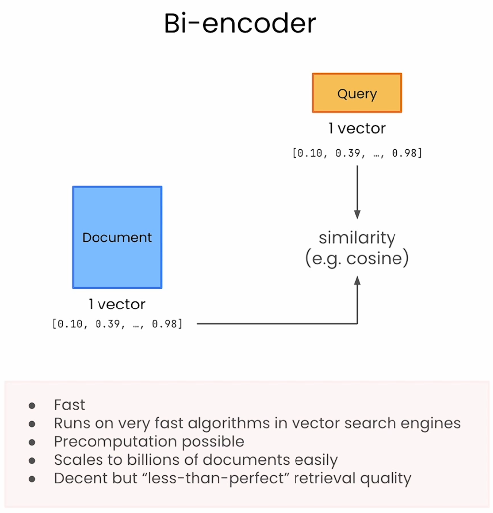

### 1. 核心工作原理

Bi-encoder 的特点是将“查询”和“文档”**分开处理**：

- **独立编码：**Document (文档)： 所有的文档被输入到一个编码器中，每个文档变成一个**单一向量（1 vector）**（例如图中显示的数字列表 [0.10, 0.39, ...]）。**Query (查询/提问)：** 用户的提问也被输入到一个（通常是同一个）编码器中，变成一个**单一向量**。
- **计算相似度（Similarity）：**系统不会让模型同时阅读问题和文档，而是直接对这两个向量进行简单的数学计算。最常用的算法是 **余弦相似度 (Cosine Similarity)**。这种计算极其简单、飞快。

### 2. Bi-encoder 的主要优势（看列表部分）

- **Fast (快)：** 整个计算过程只是简单的向量对比，速度极快。
- **Runs on very fast algorithms (适配极速算法)：** 它可以在向量搜索引擎（如 Milvus, Pinecone, FAISS）中使用高效的索引算法（如 HNSW），实现毫秒级的响应。
- **Precomputation possible (支持预计算)：** **这是它最大的优点**。你可以在用户提问之前，就把成千上万甚至数亿个文档预先转换成向量并存入数据库。当用户提问时，只需要实时计算一个“提问向量”即可。
- **Scalability (扩展性强)：** 能够轻松应对**数十亿级**的文档搜索。

### 3. 局限性

- **Decent but "less-than-perfect" (检索质量尚可，但不完美)：**由于查询和文档在编码阶段是“互不相见”的，它们之间细微的语义交互（比如某些词在特定语境下的特殊含义）可能会丢失。它的准确度通常不如 **Cross-encoder（交叉编码器）**，后者会让模型同时阅读查询和文档，但速度会慢成百上千倍。

### 总结与应用场景

在实际的 RAG 系统中，Bi-encoder 通常充当**“粗排” (First-stage Retrieval)** 的角色：

1. **第一步：** 用 Bi-encoder 从数百万个文档中快速捞出最相关的 100 个结果（利用其“快”和“预计算”的特点）。
2. **第二步（可选）：** 再用更精确但更慢的 Cross-encoder 对这 100 个结果进行“精排”。

**一句话总结：Bi-encoder 是 RAG 的“搜索引擎”，负责在海量数据中实现极致的搜索速度。**

## 二、交叉编码器

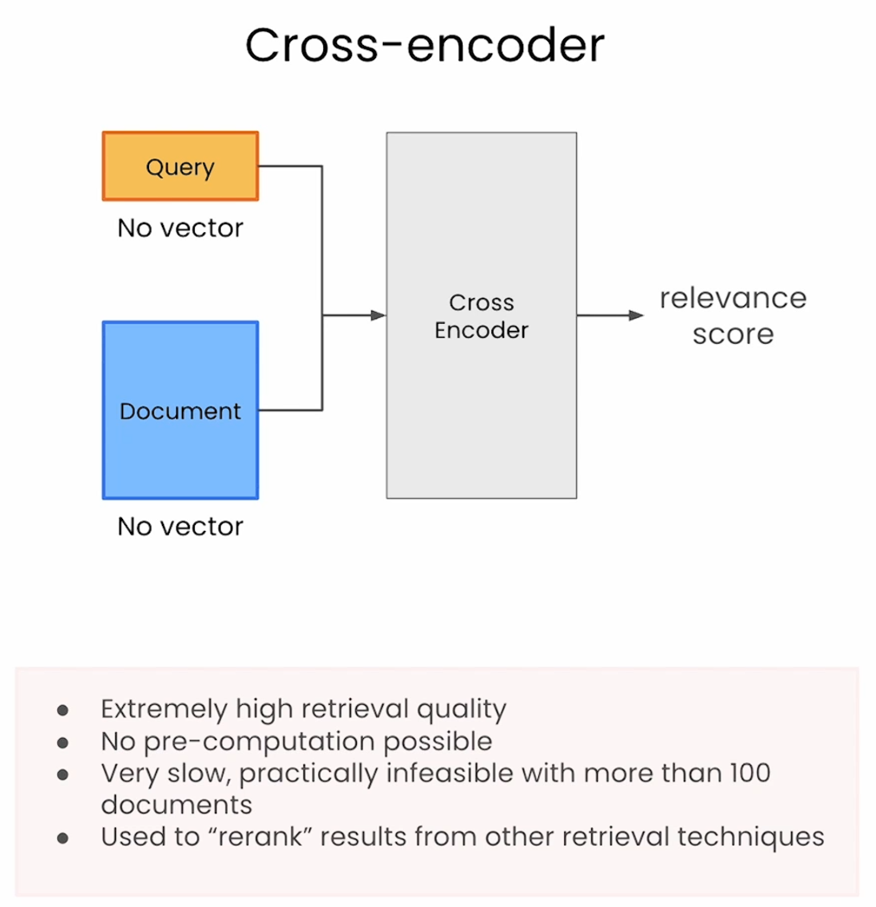

### 1. 核心工作原理

与 Bi-encoder 分开处理不同，Cross-encoder 采取的是**“深度交互”**的方式：

- **输入方式：** 如图所示，Query（查询）和 Document（文档）被**同时**输入到一个模型（Cross Encoder）中。
- **No vector（无固定向量）：**在图中，两者下方都标有“No vector”。这意味着它不像 Bi-encoder 那样为每个文档预先生成一个独立的向量存入数据库。它是在处理时，让查询和文档中的每一个词都进行两两对比（通过 Transformer 的自注意力机制）。
- **输出：** 模型直接输出一个 **relevance score（相关性评分）**。这个分数代表了该文档与该查询之间相关的程度（例如 0 到 1 之间的一个值）。

### 2. Cross-encoder 的特点

- **Extremely high retrieval quality (极高的检索质量)：**这是它最大的优点。因为模型能够同时看到查询和文档，它可以理解非常细微的语义联系和语境信息，判断精准度远高于 Bi-encoder。
- **No pre-computation possible (无法进行预计算)：**由于得分取决于“查询”和“文档”的**特定组合**，你无法在不知道用户提什么问题的情况下预先计算出分数。这意味着你没法把结果存进向量数据库来加速。
- **Very slow (速度非常慢)：**对于每一对“查询-文档”，模型都需要运行完整的深度计算。如果你有 100 万个文档，用户问一个问题，你需要跑 100 万次深度模型计算，这在计算资源和时间上是完全不可接受的。课件指出：如果文档数量超过 100 个，在实际应用中就几乎不可行了。
- **Used to "rerank" (用于“重排序”)：**这是它的核心定位。它不负责从大海里捞针，而是负责在捞上来的“小样”里选优。

### 3. 总结：Bi-encoder vs. Cross-encoder

在工业界的 RAG 系统中，通常会将两者结合使用，形成一个**“漏斗式”**的流程：

1. **粗排 (Retrieval)：** 使用 **Bi-encoder**。利用它的“预计算”和“快速向量检索”能力，从 1 亿个文档中快速选出最相关的 100 个。
2. **精排 (Rerank)：** 使用 **Cross-encoder**。对这 100 个结果进行逐一精细对比，给出准确的排名，选出最后交给 LLM 的前 5 个文档。

**一句话总结：Cross-encoder 是 RAG 的“裁判”，虽然动作慢、耗能高，但看人（文档相关性）极其准。**

## 三、ColBERT

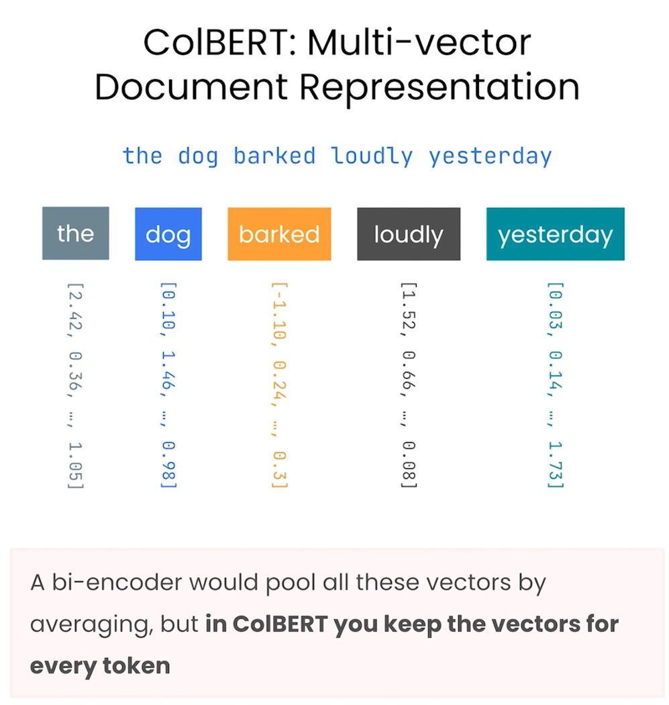

### 1. 核心概念：多向量 vs. 单向量

- **普通的 Bi-encoder（对比）：** 正如课件下方的文字所述，普通的 Bi-encoder 在处理“the dog barked loudly yesterday”这句话时，会把所有词的特征“池化”（Pooling），通常是通过取**平均值**的方法，最终将整句话压缩成 **1 个向量**。*缺点：* 这种“压缩”会造成信息损失，模糊了词与词之间的具体关系。
- **ColBERT 的做法：** 它不进行压缩。如图片所示，句子中的每一个词（token）——“the”、“dog”、“barked”、“loudly”、“yesterday”——都会生成并保留**自己独立的向量**。*结果：* 如果一句话有 5 个词，ColBERT 就会存 5 个向量；如果有 100 个词，就存 100 个向量。

### 2. 为什么要这么做？（优势）

- **更精准的匹配（更细粒度）：** 因为保留了每个词的向量，在搜索时，系统可以进行“词对词”的细致比对。例如，它可以精确匹配到“dog”和“barked”之间的语义联系，而不是看整句话的大概意思。
- **性能平衡：** ColBERT 的目标是获得接近 **Cross-encoder** 的极高准确度，同时保留 **Bi-encoder** 那样可以预计算、在大规模数据中快速检索的特性。这种机制被称为“延迟交互”（Late Interaction）。

### 3. 这种做法的代价（权衡）

- **存储空间（Storage）：** 这是 ColBERT 最大的挑战。因为每个文档不再只存 1 个向量，而是存 N 个（N=单词数），这会导致向量数据库的体积膨胀 **10 倍甚至几十倍**。
- **计算复杂度：** 虽然比 Cross-encoder 快，但由于要对比多个向量，它的检索计算量比简单的单向量 Bi-encoder 要大。

### 总结

这页课件揭示了 RAG 检索技术的一种进化方向：

- **Bi-encoder:** 1 个文档 = 1 个向量（快，但不够准）。
- **ColBERT:** 1 个文档 = N 个向量（准，但费空间）。

**一句话总结：ColBERT 通过“记住”文档中每一个词的特征（多向量），解决了普通向量检索容易丢失细节的问题，是目前高性能 RAG 系统中的热门选择。**

## 四、MaxSim

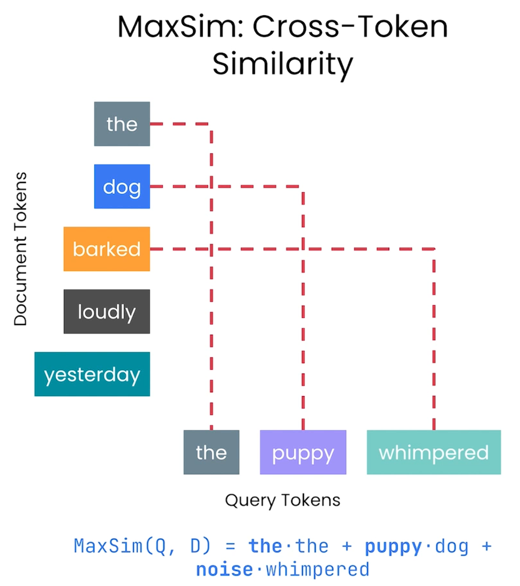

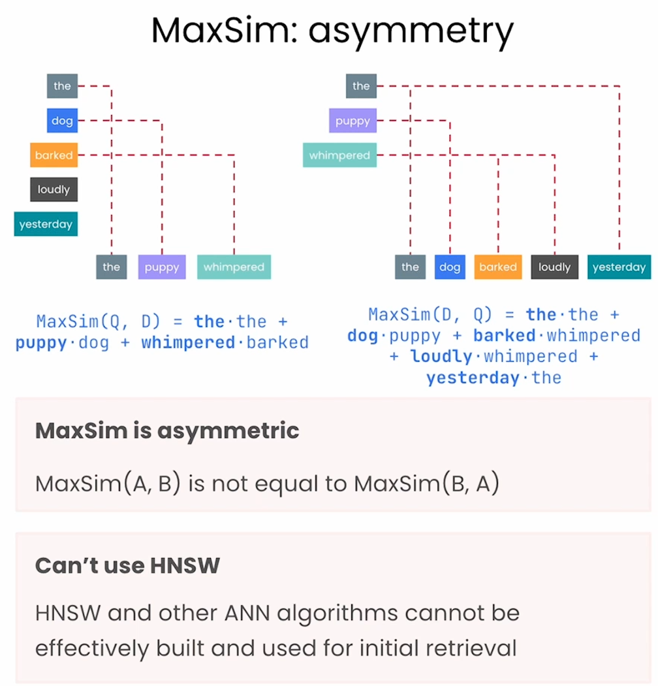

### 1. MaxSim 的工作原理：跨词项相似度

MaxSim 是 ColBERT 计算“查询”和“文档”相关性的方式。

- **操作逻辑：**取查询（Query）中的**每一个词**。让这个词去跟文档（Document）里的**所有词**逐一对比。在这个词与文档所有词的对比中，只取**相似度最高（最大值）**的那一个。最后，把查询中每个词得到的“最大相似度分数”**加总**，得到最终的总分。
- **例子：**查询是 "the puppy whimpered" (小狗呜咽)。文档是 "the dog barked loudly yesterday" (狗昨天大声吠叫)。**匹配过程：** "the" 匹配到了文档里的 "the"；"puppy" 虽然没在文档里，但它与 "dog" 语义最接近，所以取了与 "dog" 的匹配分；"whimpered" 匹配到了语义最接近的 "barked"。
- **核心价值：** 这种方式允许模型捕捉到极其细微的**语义对齐**（比如 puppy 和 dog），即使词汇不完全一样也能精准匹配。

### 2. MaxSim 的非对称性 (Asymmetry)

这是 MaxSim 与传统余弦相似度（Cosine Similarity）最大的数学区别。

- **非对称性：** `MaxSim(Q,D)≠MaxSim(D,Q)`。
- **原因：**计算 `MaxSim(Q,D)` 时，分数是由**查询中的单词数量**决定的（比如图中查询 3 个词，就加总 3 个分）。计算 `MaxSim(D,Q)` 时，分数是由**文档中的单词数量**决定的（图中文档 5 个词，就加总 5 个分）。
- **结论：** 谁是“提问者”，谁是“被检索者”，结果是不一样的。在 RAG 中，我们永远是以查询（Q）去匹配文档（D）。

### 3. 技术挑战：无法直接使用 HNSW

这一条解释了为什么 ColBERT 虽然厉害，但在工程实现上比普通向量检索复杂得多。

- **背景：** 普通的向量检索（Bi-encoder）可以用 **HNSW** 这种极快的索引算法，在几毫秒内从亿万向量中找到最接近的一个。
- **问题：** HNSW 是为“单向量对单向量”的距离计算设计的。
- **ColBERT 的困境：** 由于 MaxSim 涉及到“一个查询向量组”对“一个文档向量组”的复杂求和运算，**传统的 HNSW 索引无法直接处理这种多对多的匹配逻辑**。
- **影响：**这意味着你不能直接把 ColBERT 的多向量简单扔进一个现成的向量数据库（如普通的 FAISS 或 Pinecone 早期版本）就期待它跑得飞快。为了解决这个问题，ColBERT 团队开发了专门的压缩和加速技术（如 ColBERTv2 里的 PLAID 机制），但这比普通检索要复杂得多。

## 五、优缺点

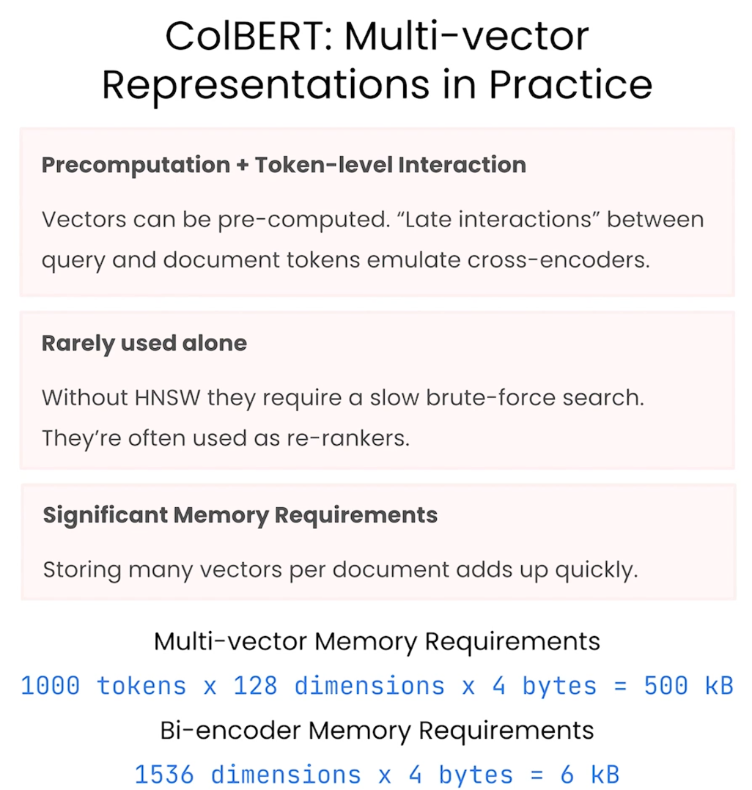

### 1. 核心机制：预计算 + 词项级交互 (Late Interaction)

- **延迟交互 (Late Interaction)：** 这是 ColBERT 的精髓。它允许像 Bi-encoder 一样**预先计算**并存储文档的向量。但在检索时，它又像 Cross-encoder 一样进行**词与词之间（Token-level）的交互对比**。
- **效果：** 这种设计让它能以比 Cross-encoder 快得多的速度，达到极其接近后者的检索精度。它在“快”和“准”之间找到了一个平衡点。

### 2. 实际部署：很少单独作为初始检索工具

- **挑战：** 课件提到，由于 ColBERT 很难直接适配 HNSW 这种超大规模索引加速算法，它往往需要进行“暴力搜索”（Brute-force search）。
- **解决方案：** 在实际工程中，它最常被用作 **Reranker（重排序器）**。**流程：** 先用超快的 Bi-encoder 从海量库中捞出 100-1000 个候选文档，然后再由 ColBERT 对这 1000 个文档进行精确排序。

### 3. 核心痛点：显著的内存与存储需求

这是本页课件最直观的部分，通过具体计算展示了 ColBERT 的“昂贵”：

- **ColBERT (多向量模式)：**假设一个文档有 1000 个词（Tokens）。每个词对应一个 128 维的向量。计算：`1000×128×4` 字节 `≈≈` **500 kB**。
- **Bi-encoder (单向量模式)：**无论文档多长，最后只存一个向量（例如 1536 维，常见于 OpenAI 模型）。计算：`1536×4` 字节 `≈≈` **6 kB**。

**对比结论：**
ColBERT 存储同一个文档所需的空间是传统单向量模型的 **80 多倍**（500 kB vs 6 kB）。这意味着如果你有 1 亿个文档，普通模型可能只需要几台服务器的内存，而 ColBERT 可能需要一整个机房的内存来支撑。

### 总结

这页课件是在给开发者做“打预防针”：

1. **ColBERT 非常准：** 它拥有词项级的交互能力。
2. **ColBERT 很重：** 它的存储开销极其巨大，是普通向量检索的几十倍。
3. **最佳实践：** 把它当成 **Reranker（重排序器）** 来用，既能发挥它的精度优势，又能规避它在大规模检索时的性能和存储短板。

**一句话总结：ColBERT 是用昂贵的存储空间换取极高的检索精度，通常在 RAG 流程的最后精选阶段大显身手。**

## 六、ColPali 诞生的背景

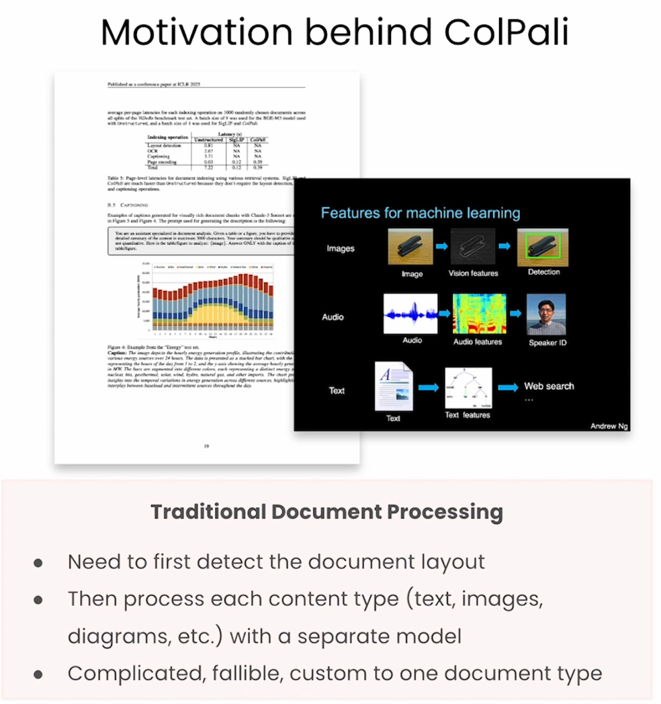

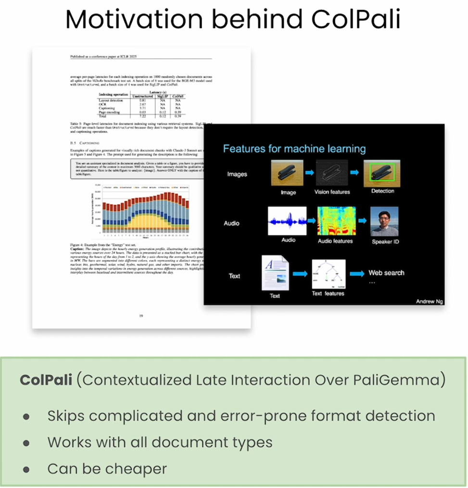

### 1. 传统文档处理的“噩梦”

在传统的 RAG 流程中，如果你想处理像左上角那种包含**表格、统计图、分栏排版**的 PDF 文档，通常需要经历一个非常痛苦的流水线：

- **版面分析（Layout Detection）：** 首先得用一个模型来判断哪里是正文，哪里是标题，哪里是图片。
- **分而治之（Separate Models）：**文字部分要送去 **OCR** 识别，变成纯文本。图片和图表要送去专门的视觉模型生成 **Caption**（描述文字）。表格要尝试转换成 **Markdown** 或 **HTML** 格式。
- **痛点：**极其复杂： 每一步都要用不同的模型，整个 Pipeline 非常臃肿。**极易出错（Fallible）：** 如果 OCR 识别错了一个数字，或者版面分析把图表的注释当成了正文，后面的 LLM 就会由于输入了错误信息而产生“幻觉”。**难以通用：** 针对发票、论文、宣传册等不同类型的文档，往往需要定制不同的解析规则。

### 2. ColPali 的核心理念：端到端的视觉检索

**ColPali** 的全称是 *Contextualized Late Interaction Over **PaliGemma***。它的核心逻辑是：**“别解析了，直接看图。”**

- **基本原理：** 它基于谷歌的 **PaliGemma**（一个视觉语言模型 VLM）。它不再尝试把 PDF 转换成纯文本，而是直接把 PDF 的**页面图像**输入模型。
- **ColPali 的优势：**跳过解析（Skips Format Detection）： 它不需要 OCR，不需要版面分析，也不需要图片描述。它直接对整个页面进行视觉编码。**全类型通用（Works with all document types）：** 无论文档排版多复杂，对于模型来说都只是一张图。它能直接“读”出图表中的趋势、表格中的数据。**更经济（Can be cheaper）：** 尽管视觉模型的计算开销大，但它省去了前端那一串复杂的预处理流水线和多模型维护成本。

### 3. 技术深度联系：Col + Pali

如果你结合前面几页课件，就能理解 ColPali 这个名字的深意：

1. **"Pali" (PaliGemma)：** 提供视觉理解能力。模型通过视觉 Transformer（ViT）将页面图像切成很多小块（Patches），每个小块都变成一个向量。
2. **"Col" (ColBERT)：** 提供**延迟交互（Late Interaction）**机制。它保留了页面中每个视觉小块的向量。当你输入一个文字查询（Query）时，模型会让查询里的每个词去和 PDF 页面里的**每个视觉小块**做 **MaxSim** 匹配。**例子：** 比如你问“2023年利润是多少？”，模型会直接定位到 PDF 图像中那个包含利润数字的表格小方块。

### 总结：RAG 的范式转移

这两页课件展示了 RAG 检索技术的一个重大转型：

- **过去：** 文档 `→→` **复杂解析** `→→` 纯文本 `→→` 文本向量检索。
- **现在（ColPali）：** 文档 `→→` **页面截图** `→→` 视觉多向量检索。

**一句话总结：ColPali 通过将视觉语言模型（PaliGemma）与高效的检索机制（ColBERT）相结合，终结了复杂 PDF 文档解析难、易出错的历史，实现了“所见即所得”的精准检索。**

## 七、视觉语言模型处理文本输入

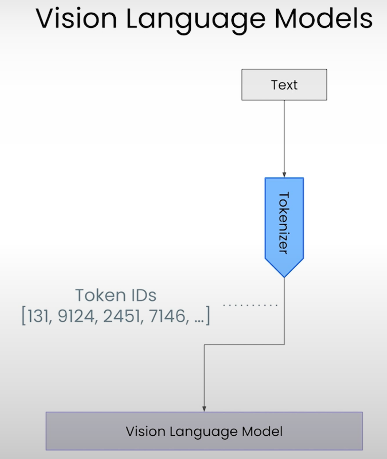

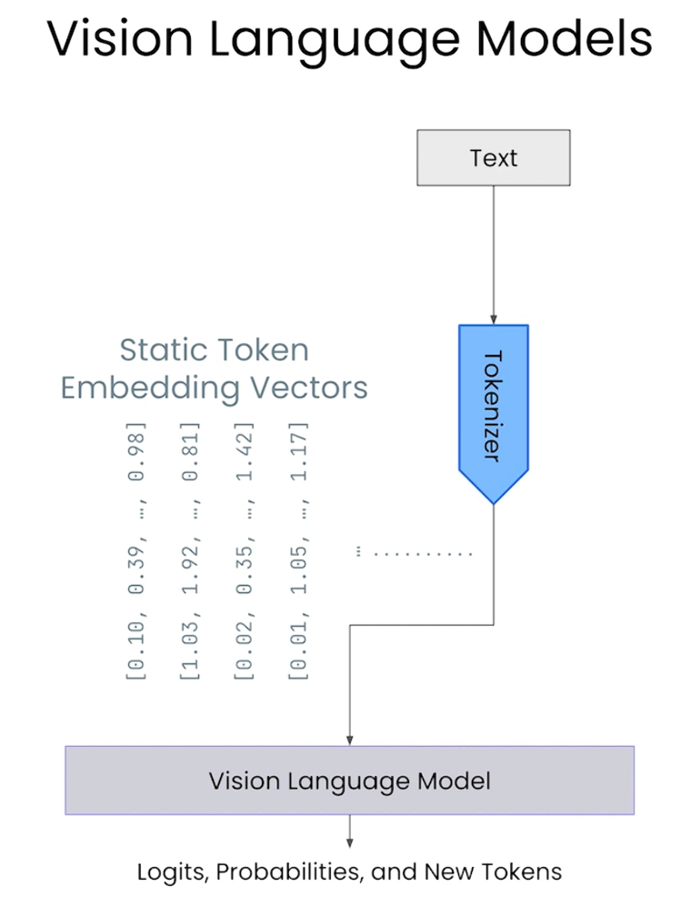

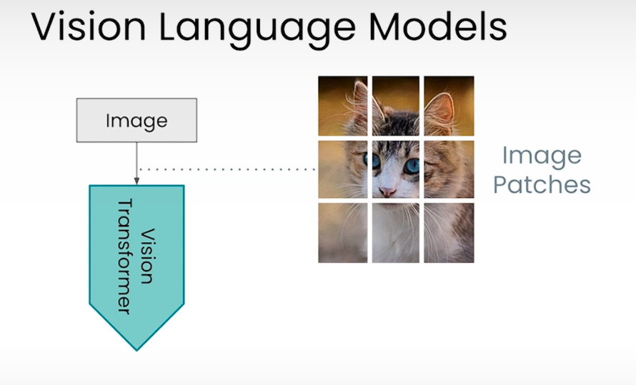

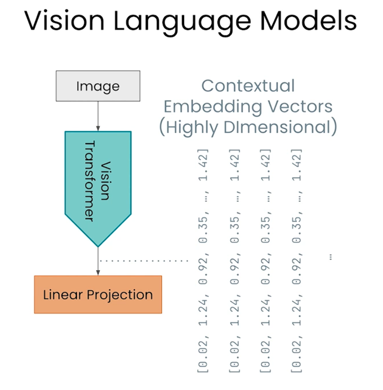

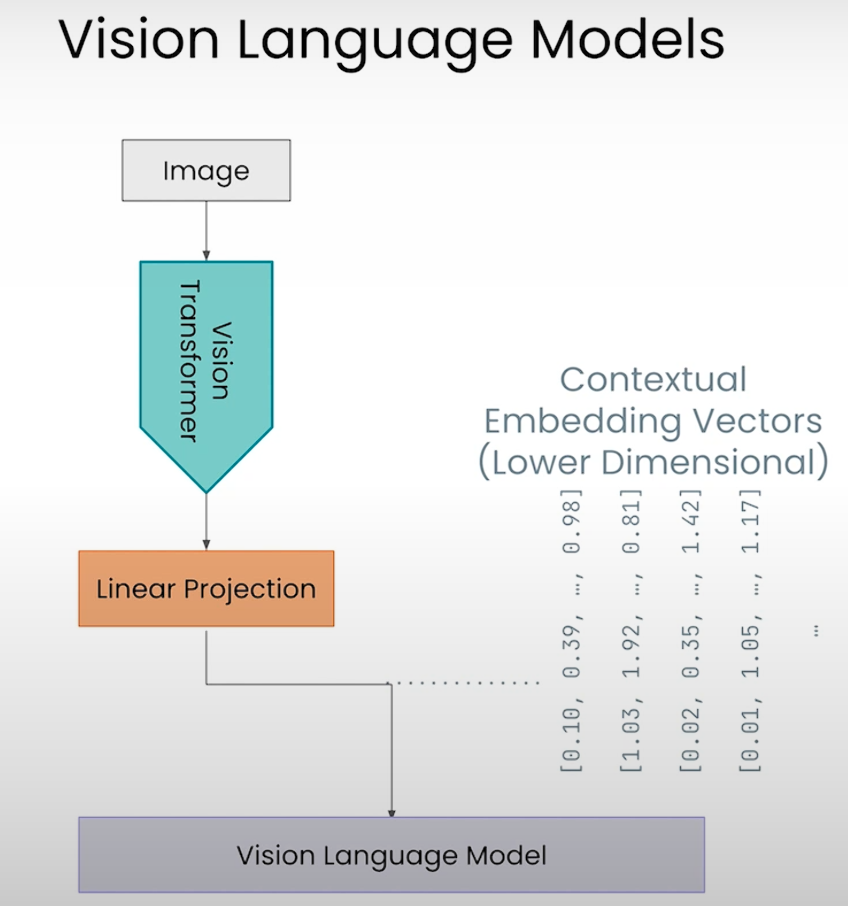

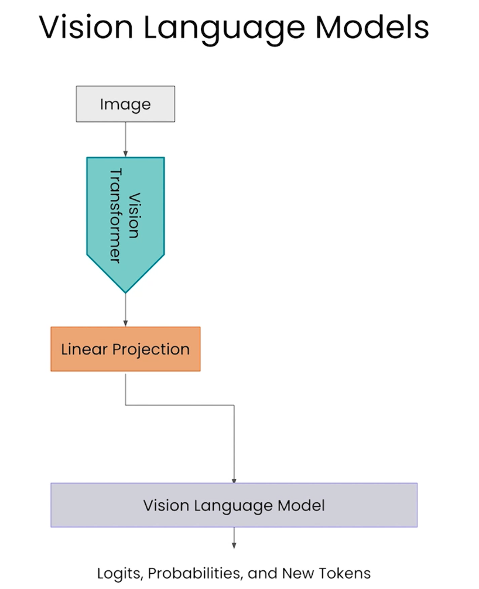

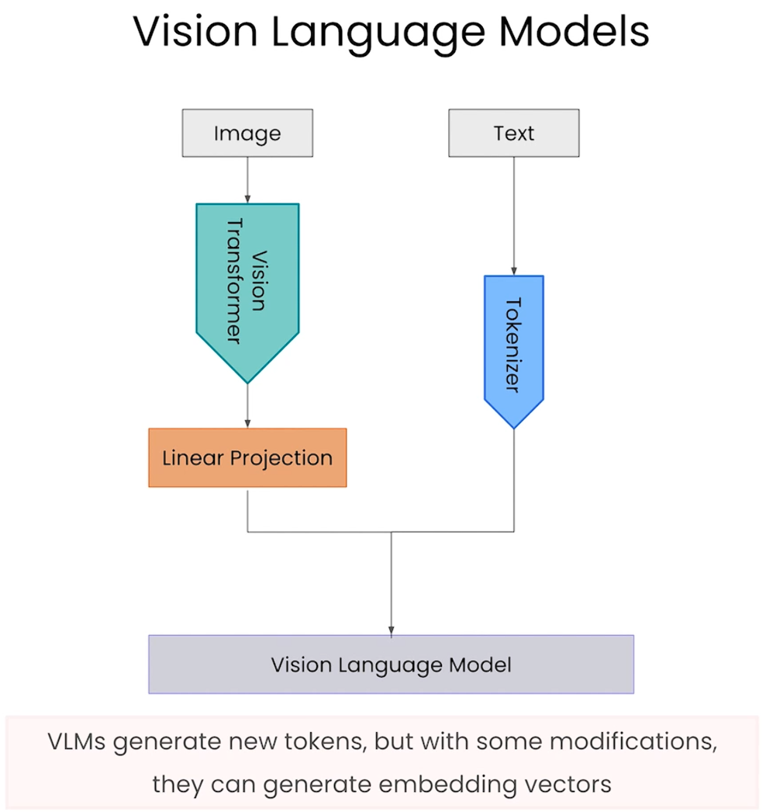

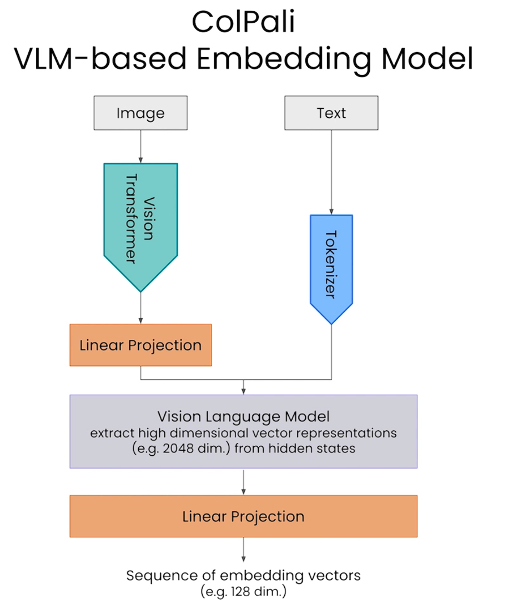

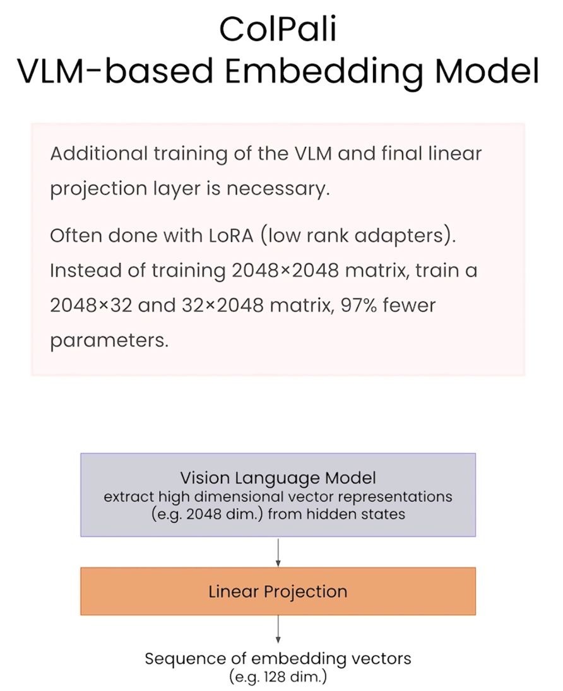

### 第一阶段：文本是如何被处理的（图1、图2）

在让大模型看图之前，我们先看看它是如何“阅读”文字的。

1. **切词（Tokenizer）：** 当输入一段文本（Text）时，模型并不能直接认识字母。它首先经过一个分词器（Tokenizer），把句子切成一个个小碎片，并转换成数字 ID（Token IDs），比如 [131, 9124, 2451...]。这就相当于查字典，找出每个词的编号。
2. **文本向量化（Static Token Embedding Vectors）：** 只有数字编号还不行。模型会把每一个 Token ID 映射成一个固定维度的浮点数列表（比如 [0.10, 0.39, ... 0.98]）。**这时候，文字就变成了包含一定基础语义的“静态向量”**，随后被送入语言模型（VLM）的大脑中。

### 第二阶段：图像是如何被处理的（图3、图4、图5）

现在，我们要让模型长出“眼睛”。

1. **图像切块（Image Patches）：** （见猫的图片）一张完整的图片不能直接塞进语言模型。视觉模型会像切豆腐一样，把图片切成一个个固定大小的小方块（Patches）。在模型眼里，**“一个图像块”就等于文本里的“一个单词（Token）”**。
2. **视觉Transformer（Vision Transformer）：** 这些图像块被送入专门处理视觉的 Transformer 模型中，提取出图像的特征。
3. **高维上下文向量（Contextual Embedding Vectors）：** 经过视觉模型处理后，每个图像块变成了一个包含视觉上下文信息的“高维向量”（比如 2048 维）。
4. **线性投影（Linear Projection - 关键桥梁）：** （见图5）因为视觉模型输出的向量维度（比如 2048 维）和语言模型接受的文本词向量维度通常不一样。所以需要加一层“线性投影”作为**翻译官/桥梁**，把视觉向量转换成和文本向量相同大小的维度（Lower Dimensional）。**这样，语言模型就能把图像块当成普通的单词来一起处理了。**

### 第三阶段：传统的视觉语言模型 VLM 是怎么工作的（图6）

这一步是将前面的文本和图像结合起来。

- **多模态融合：** 图像（经过处理变成了视觉 Token）和文本（变成了文本 Token）被放在一起，排成一长串，送进统一的 Vision Language Model 中。
- **传统任务是“生成（Generation）”：** 像 GPT-4V 这样的模型，处理完这些信息后，会在最后输出 **"Logits, Probabilities, and New Tokens"**。也就是说，它通过计算概率，**一个字一个字地生成回答（比如描述这张图里有只猫）**。

### 第四阶段：ColPali 的魔改 —— 从“生成器”变成“向量提取器”（图7、图8）

这是整个课件的核心！图6底部有一行字说：“VLM 可以生成新词，但只要稍微修改一下，它们就能生成嵌入向量（Embedding Vectors）”。**ColPali 就是做了这种修改。**

1. **不再生成文字：** ColPali 并不想让模型说话。相反，当图像和文本输入 VLM 后，ColPali 直接“剖开”模型，**提取模型最后一层隐藏状态（Hidden States）中的高维特征向量**（比如 2048 维）。
2. **最终的降维投影（Final Linear Projection）：** （见图7底部）提取出高维向量后，ColPali 再次使用一个线性投影层，把这些庞大的 2048 维向量**压缩成较小的 128 维向量（Sequence of embedding vectors, e.g., 128 dim）**。

> **💡 为什么要压缩成 128 维？**
> 你还记得之前我们讨论的 **ColBERT 和 MaxSim** 吗？
> ColPali 名字里的 "Col" 就是指 ColBERT 的后期交互机制。它把文档（包含图片和文字）转换成**一长串 128 维的小向量**。这样在搜索时，就可以极快地使用 **MaxSim** 算法，让查询词去匹配图片或文字里最相关的部分！

### 最终训练技巧：LoRA 降本增效（图8 文字页）

把一个原本用来聊天的多模态大模型改造成专门输出 128 维向量的模型，是需要**重新训练（微调）**的。但完整的 VLM 太庞大了，普通显卡根本训不动。

- **LoRA (Low Rank Adapters) 的作用：** 这是一种极其聪明的数学技巧。它不去训练原本那个巨大的 `2048×2048` 的参数矩阵，而是把它拆解成两个很小的矩阵相乘（`2048×32` 和 `32×2048`）。
- **结果：** 如图所述，这能**减少 97% 需要训练的参数**！这使得开发者可以在消耗很少算力的情况下，就把一个懂图文的大模型，训练成一个顶级的多模态搜索引擎（ColPali）。

### 总结

这套课件讲述了：我们如何把图片切块伪装成“单词”（图1-5），喂给一个多模态大模型（图6），然后**强行截断它原本想要生成的废话，直接抽取它脑子里的高维“理解”，最后压缩成 128 维的向量序列（图7）**，以便于后续利用 MaxSim 算法实现极速、精准的“以文搜图”或“图文混合搜索”。

------

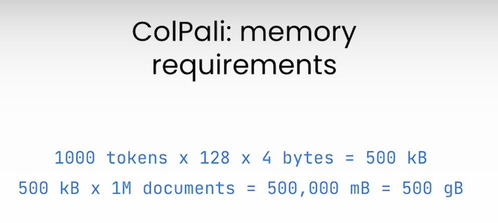

**`4 bytes`：** 这是计算机存储一个浮点数（float32）所需的标准空间。在 ColPali 中，**仅仅存储一页 PDF 的向量特征，就需要 500 KB。**

### 1. 文本分词 (Tokenizer)

- **流程：** 用户输入的原始文本（Text）首先经过一个“分词器”（Tokenizer）。
- **作用：** 机器无法直接读懂单词。分词器将句子切分成更小的单元，称为 **Tokens**（词元）。一个 Token 可能是一个完整的单词，也可能是一个词根或字符组合。

### 2. 静态词嵌入 (Static Token Embedding Vectors)

- **流程：** 每一个 Token 会根据模型预设的字典，被转换成一串数字，即**向量**（图中显示的 [0.10, 0.39, ...]）。
- **为什么叫“静态” (Static)？** 因为在这一步，向量只代表这个词本身在词库里的基本含义，还没有考虑到它在句子里的具体语境。比如“苹果”在这个阶段只代表水果，模型还没判断它是指吃的苹果还是苹果公司。

### 3. 进入模型核心 (Vision Language Model)

- **流程：** 这些静态向量被输入到模型的主体中（通常是基于 Transformer 架构）。
- **VLM 的特殊之处：** 虽然图中只画了 Text 路径，但在 **Vision** Language Model 中，模型在此处通常还会接收来自**图像（Image）**的信号（例如通过视觉编码器处理后的图像 patch 向量）。
- **深度加工：** 模型通过多层自注意力机制（Self-Attention），让文本向量与图像向量进行“沟通”。此时，向量就不再是“静态”的了，它们会吸收周围的语境信息。

### 4. 预测与输出 (Logits, Probabilities, and New Tokens)

- **流程：** 模型处理完所有信息后，会输出一层数据。
- **Logits & Probabilities：** 这是模型对下一个可能出现的词的“打分”和“概率预测”。
- **New Tokens：** 模型选择概率最高的那个词作为输出，并以此类推，逐个生成新的词元，最终拼凑成一句完整的回答。

### 总结与联系

这页课件是为后续讲解 **ColPali** 做铺垫的。在 ColPali 或类似的视觉 RAG 系统中：

1. **用户提问（Query）** 走的就是图中这条**文本路径**。
2. **文档页面（Document Page）** 走的是另一条**图像路径**（虽然本页没画，但 VLM 的核心就是处理图像）。
3. **最终目的：** 让文本向量去和图像向量做对比，从而实现“通过文字搜索图片中的内容”。

**一句话总结：这页课件展示了 VLM 如何将人类语言数字化（向量化），并最终通过概率预测生成回复的基本原理。**

## 八、ColPali 的具体架构

### 1. 双路输入处理 (Input Stage)

ColPali 同时接收两种不同形式的输入：

- **左侧：图像路径 (Image Path)** Vision Transformer (ViT)： 图像（如 PDF 的页面截图）被切成许多小方块（Patches），通过视觉 Transformer 进行特征提取。**Linear Projection (线性投影)：** 将视觉特征的维度进行调整，使其能够与语言模型的空间对齐。
- **右侧：文本路径 (Text Path)** Tokenizer (分词器)： 将文本（如用户的提问）切分成词元（Tokens）。

### 2. 核心：视觉语言模型 (VLM Core)

- 图像和文本的特征共同进入 **Vision Language Model**（例如 PaliGemma）。
- **关键点：** 模型并不是为了生成一段话，而是为了**提取特征**。
- 课件中提到：“从隐藏状态（Hidden States）中提取高维向量表示（例如 2048 维）”。这意味着模型利用其深层网络，理解了图像中小块与文本词汇之间的复杂语义联系。

### 3. 维度压缩 (Dimensionality Reduction)

- **Linear Projection (第二次线性投影)：** 2048 维的向量对于大规模存储和检索来说太大了（正如之前课件提到的存储开销问题）。
- 这一步将高维向量压缩到更小的维度（例如 **128 维**）。

### 4. 最终输出：嵌入向量序列 (Output Stage)

- **Sequence of embedding vectors：** 这是 ColPali 的精髓。
- 它输出的不是一个单一的向量，而是一组向量：对于文本，每个词对应一个 128 维向量。对于图像，每个视觉小块（Patch）对应一个 128 维向量。
- 这就完美衔接了前面提到的 **ColBERT 的延迟交互（Late Interaction）** 机制。

### 总结：为什么这个架构很强大？

1. **统一空间：** 它成功地将“视觉信息”和“文本信息”映射到了同一个 128 维的语义空间里。
2. **保留细节：** 通过输出“向量序列”而不是单个向量，它保留了文档页面上的空间细节（比如某个数字在表格的具体哪个位置）。
3. **端到端：** 整个过程不需要 OCR 识别文字，也不需要人工预处理版面，模型直接“看图”并理解其中的含义。

**一句话总结：这页课件展示了 ColPali 如何利用 VLM 的深度理解能力，将复杂的文档图片直接“翻译”成一组组精准的高性能检索向量。**

## 九、ColPali 的训练与优化

### 1. 为什么需要“额外训练”？

课件第一段指出：**“对 VLM（视觉语言模型）和最终的线性投影层进行额外训练是必要的。”**

- **原因：** 像 PaliGemma 这样预训练好的模型，虽然懂图片也懂文字，但它最初并不是为了“检索文档”而设计的。
- **目的：** 我们需要通过训练，教模型如何把“用户的提问”和“文档图像中的特定位置”在 128 维的向量空间里精准对齐。

### 2. 核心优化技术：LoRA (低秩自适应)

由于视觉语言模型通常拥有数十亿个参数，全量训练（更新所有参数）会消耗巨大的计算资源。ColPali 采用了工业界最流行的 **LoRA (Low-Rank Adapters)** 方案：

- **原理：** 训练时冻结原始模型的大部分权重，只在旁边插入两个很小的“低秩矩阵”进行微调。
- **数学逻辑（课件中的例子）：**传统训练： 如果要训练一个 `2048×2048` 的大矩阵，需要更新约 **420 万**个参数。**LoRA 训练：** 它将其分解为两个小矩阵——一个 `2048×32` 和一个 `32×2048`。**惊人的效率：** 这种方法只需要更新约 **13 万**个参数。课件强调，这减少了 **97% 的参数量**。
- **结果：** 这使得在普通显卡上训练如此强大的视觉检索模型成为可能，且效果几乎不打折扣。

### 3. 线性投影层（Linear Projection）的微调

课件下半部分的示意图再次强调了这一步：

- **高维到低维：** 模型内部处理时使用 2048 维的高维特征。
- **投影层：** 这一层负责将 2048 维“压缩”到 128 维。
- **意义：** 这一层必须经过训练，才能确保在压缩过程中不丢失关键的语义信息，从而生成高效的“嵌入向量序列”。

### 总结：这页课件的核心信息

这页课件告诉开发者，ColPali 不仅仅是一个现成的模型架构，它还是一套**高效的训练方案**：

1. **必须微调：** 必须针对检索任务进行专门的对齐训练。
2. **极速优化：** 利用 **LoRA** 技术，只需更新不到 3% 的参数即可完成训练。
3. **性能平衡：** 通过训练投影层，将庞大的 VLM 输出转化为精简的 128 维向量，平衡了检索精度和存储成本。

**一句话总结：这页课件揭示了 ColPali 是如何通过 LoRA 这种“以小博大”的算法，在保证高性能的同时，实现了低成本的训练和部署。**

## 十、优化技术

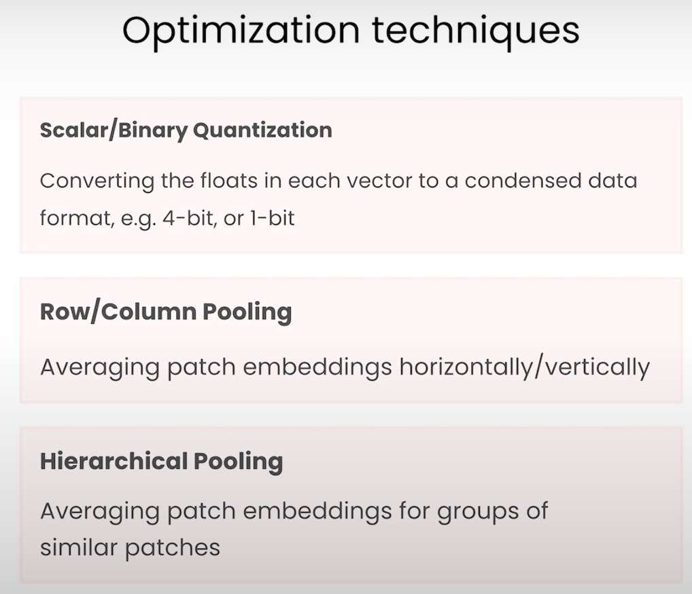

还记得前面课件提到的 ColPali 最大的痛点吗？——**存储开销巨大**（由于每个词或每个图像小块都要存一个向量，存储需求比普通模型高出几十倍）。这页课件给出的三项技术，核心目标都是为了**“瘦身”：在尽量不损失精度的前提下，大幅减少存储空间和计算量。**

### 1. 标量/二进制量化 (Scalar/Binary Quantization)

这是对**单个数字**的压缩。

- **原理：** 原始向量中的数字通常是 32 位浮点数（float32）。量化技术将这些高精度的数字转换成更紧凑的格式，比如 **4位（4-bit）** 甚至 **1位（1-bit，即二进制）**。
- **效果：**如果是二进制量化，原来的一个数字需要 32 位空间，现在只需要 1 位。存储空间理论上可以瞬间缩小 **32 倍**。二进制向量之间的对比速度极快（使用异或运算），能极大提升检索效率。

### 2. 行/列池化 (Row/Column Pooling)

这是对**向量数量**的初级压缩，主要针对图像。

- **背景：** 在 ColPali 中，一张图片会被切成一个网格（比如 `32×32` 个小块），产生上千个向量。
- **原理：** 通过在水平（行）或垂直（列）方向上取**平均值**，将一整行或一整列的特征合并。
- **效果：** 比如原来一个网格有 1024 个向量，通过这种池化，可能只需要存储 32 个行向量和 32 个列向量，显著减少了需要存储和检索的向量总数。

### 3. 层级池化 (Hierarchical Pooling)

这是对**向量数量**的高级/智能压缩。

- **原理：** 并不是生硬地按行或列平均，而是将**相似的图像块（patches）**进行分组并取平均。
- **逻辑：** 在一个文档页面里，很多地方可能是纯白的背景，或者是大面积相同的颜色/纹理。这些区域产生的小块向量非常接近。
- **效果：**模型可以智能地把这些“重复”或“信息量低”的向量合并成一个代表性的向量。这不仅节省了空间，还能让模型更关注那些“独特”且“包含关键信息”的区域（如文字、图标、图表变化处）。

### 总结

这页课件展示了工业界如何让“昂贵”的 ColPali 变得“实用”：

1. **量化**：让每个向量变**“瘦”**。
2. **池化（行/列及层级）**：让向量的总个数变**“少”**。

通过这些技术的组合，开发者可以在保持 ColPali 强大的视觉检索能力的同时，将其存储成本降低到企业可以接受的范围。

## 十一、层级词元池化

它是对 **ColPali** 等视觉模型输出的大量“图像小块向量”（Patch Tokens）进行压缩的一种高级方法。我们可以通过以下三个层面来解读这张图：

### 1. 图像的“词元化”（Grid Segmentation）

- **视觉表现：** 猫咪的头像被切分成了 `3×3` 的网格（共 9 个小块）。
- **技术背景：** 在视觉语言模型中，一张完整的文档页面会被切成成百上千个这样的小方块。每个方块都会生成一个独立的向量。如果每个都存，存储压力巨大。

### 2. 语义分组（Color Coding / Semantic Grouping）

图中使用了不同的颜色（红、绿、蓝、黄）对网格进行了标注，这代表了模型对这些小块进行的**语义分类或相似度识别**：

- **黄色区域（中心）：** 对应猫的眼睛和鼻子。这是信息量最高、最核心的区域。在检索时，用户最可能搜索这些特征。
- **红色区域（顶部两侧）：** 对应猫的耳朵。这些区域具有相似的视觉特征。
- **绿色区域（中间层）：** 对应脸部的侧面。
- **蓝色区域（底部）：** 对应下巴或脖子处。

### 3. 如何进行“池化”压缩？

“层级池化”的核心逻辑就在于这些颜色分组：

- **合并同类项：** 模型不会死板地存储全部 9 个向量，而是将**颜色相同（语义相似）**的区域进行合并（通常是取加权平均值）。
- **瘦身结果：**如果不池化：需要存储 **9 个**向量。池化后：可能只需要存储 **4 个**代表性向量（一个红色代表向量、一个绿色代表向量、一个蓝色代表向量、一个黄色代表向量）。
- **智能保留细节：** 层级池化之所以“高级”，是因为它可以设定：对于黄色（核心特征）区域，保留更多的细节；而对于蓝色（背景或次要特征）区域，则可以进行更大比例的合并。

### 总结

这张图解释了如何通过**“看图说话”式的智能归类**，把图像中冗余的信息剔除掉：

1. **识别**哪些部分是相似的（比如背景、大面积色块）。
2. **聚类**这些相似的视觉词元（Tokens）。
3. **压缩**存储，从而解决 ColPali 存储开销过大的致命缺陷。

**一句话总结：层级词元池化就像是把图片中“长得像”的小块打包处理，只留下一组最精华的“代表向量”来代表整张图。**

## 十二、MUVERA

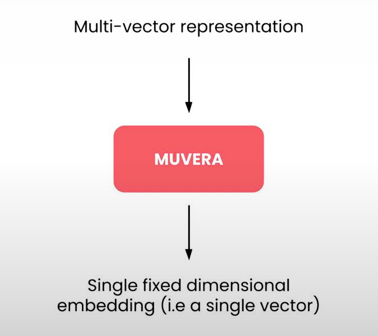

一种名为 **MUVERA** 的技术（由 Google DeepMind 开发），它的核心作用是**将“多向量表示”压缩为“单向量表示”**。

### 1. 输入端：Multi-vector representation（多向量表示）

- 这指的是 **ColBERT** 或 **ColPali** 输出的结果。
- 正如我们之前学到的，一个文档页面会被切成几百个小块，产生几百个向量。这种方式虽然极其精准，但**存储空间大**且**无法直接使用传统的 HNSW 索引**进行超大规模检索。

### 2. 核心：MUVERA

- **MUVERA** 是一个特殊的处理层或算法架构。
- 它的任务是扮演一个“**超级翻译官**”或“**超级压缩机**”。它能深度理解那一组多向量序列中的复杂语义和空间关系。

### 3. 输出端：Single fixed dimensional embedding（单一固定维度嵌入，即单向量）

- 经过 MUVERA 处理后，原本庞大的向量序列被聚合成了一个**单一的向量**（Bi-encoder 风格）。
- **这意味着：** 一个复杂的、包含图表的 PDF 页面，最终在数据库里只占用一个向量的存储空间。

### 4. 为什么要这么做？（MUVERA 的核心价值）

这页课件揭示了 RAG 检索技术的**“鱼与熊掌兼得”**：

1. **兼容性革命：** 之前课件提到 MaxSim 算法“不能使用 HNSW”（Can't use HNSW）。而 MUVERA 产出的是单向量，这让它可以**完美兼容现有的所有向量数据库**（如 Milvus, Pinecone, Weaviate）和极速的 **HNSW 索引**。
2. **存储空间骤降：** 将存储开销从几百 kB 降低到几 kB，解决了 ColPali 的“昂贵”问题，使其具备了处理**十亿级**文档的能力。
3. **性能保留：** MUVERA 的精妙之处在于，它生成的这个“单向量”并不是简单的平均值，而是通过特定的神经网络学习到的聚合表示，它尽量**保留了 ColPali 视觉理解的精髓**。

### 总结：技术演进图谱

为了方便你理解整个课程逻辑，我们可以这样连贯起来看：

- **Bi-encoder:** 简单单向量，快但不准。
- **ColPali:** 复杂多向量，极其准但太占空间、太慢。
- **MUVERA:** 用 ColPali 的眼光去看文档，但最后把知识浓缩成一个单向量。

**一句话总结：MUVERA 的出现，是为了让 ColPali 这种极其强大的“视觉理解能力”，能像普通搜索引擎一样快、一样省钱。**

## 十三、为什么需要 MUVERA

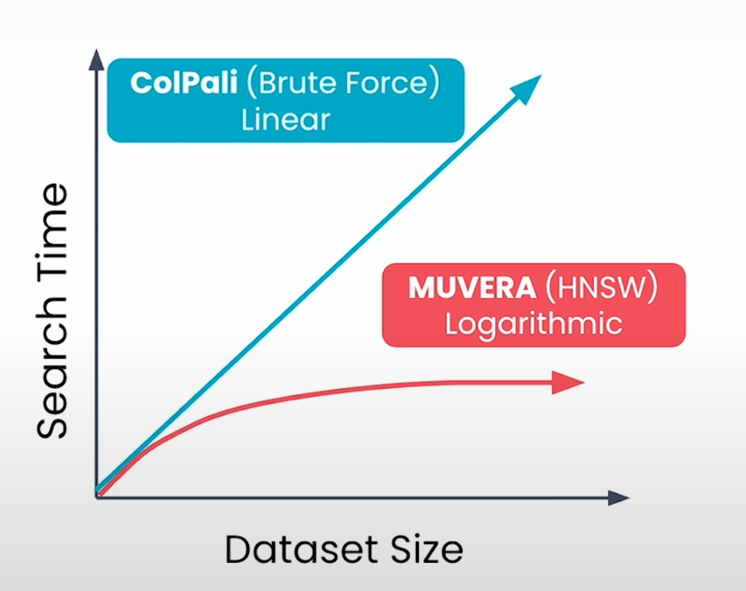

### 1. 蓝色曲线：ColPali (Brute Force) —— 线性增长

- **技术特点：** 采用“暴力搜索”（Brute Force）。这意味着每增加一份文档，系统都要进行完整的计算比对。
- **增长规律：** **线性 (Linear)**。如图所示，随着数据集大小（Dataset Size）的增加，搜索时间（Search Time）呈直线状快速上升。
- **实际意义：** 如果你只有少量文档，ColPali 很快。但一旦文档数量达到百万或千万级，搜索一次可能需要几秒甚至几分钟。这种规模下的搜索是“不可扩展”的。

### 2. 红色曲线：MUVERA (HNSW) —— 对数增长

- **技术特点：** 正如上一页课件提到的，MUVERA 将多向量压缩成了单向量，因此它可以使用 **HNSW** 索引算法。
- **增长规律：** **对数 (Logarithmic)**。曲线在开始时有上升，但很快就趋于平缓。
- **实际意义：** 在对数增长模式下，即使数据集规模翻了 10 倍，搜索时间的增加也非常微小。这使得 MUVERA 能够轻松应对**十亿级（Billion-scale）**的文档检索，并保持毫秒级的响应速度。

### 3. 核心对比：为什么这种差异至关重要？

- **可扩展性（Scalability）：**ColPali 像是一个人肉眼在一叠纸里找信息，纸越多，找得越慢。**MUVERA** 像是在图书馆查目录索引，哪怕书架增加了十倍，通过目录定位的速度依然飞快。
- **成本与用户体验：**对于企业级 RAG 系统，用户无法容忍长达数秒的检索延迟。MUVERA 通过引入 HNSW，将原本高昂的搜索时间成本压低到了极致。

### 总结：本课程的逻辑闭环

这页课件是整个技术演进讨论的“落脚点”：

1. **ColPali：** 解决了“看得准”的问题（视觉理解力极强）。
2. **MUVERA：** 解决了“跑得快”的问题（通过压缩向量实现 HNSW 加速）。
3. **最终结论：** MUVERA 结合了 ColPali 的视觉深度和 HNSW 的检索速度，是处理海量、复杂格式文档（如 PDF 库）的**终极工程方案**。

**一句话总结：这页图表证明了 MUVERA 是让先进视觉检索技术真正走进大规模商业生产环境的关键。**

## 十四、SimHash：Token Embeddings

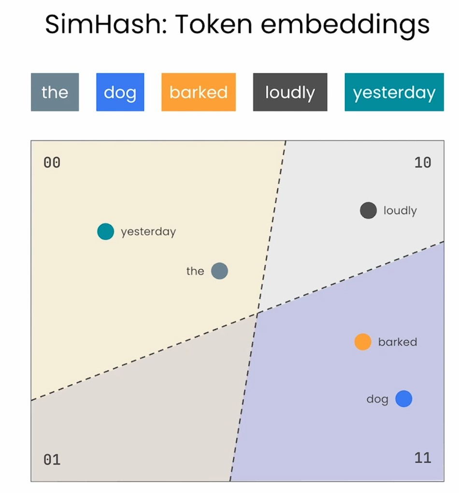

### 1. 核心目标：空间切分与二进制化

SimHash 的本质是将高维的、复杂的向量，转换成简短的 **二进制编码（Hash）**，同时保留它们之间的相似性。

### 2. 图解步骤：

- **Token Embeddings（词元）：**图中上方的 "the", "dog", "barked" 等每个词，在模型内部都是一个高维向量。在下方的 2D 坐标系中，这些词被简化为一个个**圆点**。
- **随机超平面（Dashed Lines）：**图中的两条**虚线**代表“随机产生的超平面”。这些线将整个语义空间切分成了不同的区域。
- **二进制赋值（00, 01, 10, 11）：**每条线相当于一个“开关”：比如对于第一条线，向量落在左边记为 0，右边记为 1。对于第二条线，落在上边记为 0，下边记为 1。这样，空间中的每个区域就拥有了一个唯一的二进制代码：**00 区域：** 包含了 "yesterday" 和 "the"。**11 区域：** 包含了 "dog" 和 "barked"。**10 区域：** 包含了 "loudly"。

### 3. 这对 MUVERA 意味着什么？

这页课件展示了 MUVERA 是如何“归纳”信息的：

1. **局部敏感性：** 注意到 "dog" 和 "barked" 落在同一个区域（11）。这意味着在向量空间中距离相近的词，更有可能获得相同的 Hash 编码。
2. **特征提取：** 虽然一个文档有成百上千个 Token，但 MUVERA 通过这种方式，可以统计哪些“区域（桶）”里有 Token，哪些没有。
3. **合成单向量：** 最终，MUVERA 不是存下所有的圆点（多向量），而是存下这些圆点在各个区域分布的**总特征（类似于一种“指纹”）**。这个“指纹”就是一个**单一的固定维度向量**。

### 总结

这页课件通过可视化的方式告诉我们：**SimHash 就像是在语义空间里画格子。**

- **输入：** 一堆乱跑的圆点（ColPali 输出的多向量序列）。
- **处理：** 用虚线（随机投影）把空间切开。
- **输出：** 记录圆点落在了哪些格子里（二进制编码）。

**一句话总结：SimHash 是 MUVERA 实现“降维打击”的数学武器，它把复杂的词元分布简化成了易于检索的二进制指纹，从而实现了用单向量代表整篇复杂文档的目的。**

## 十五、SimHash：clustering documents

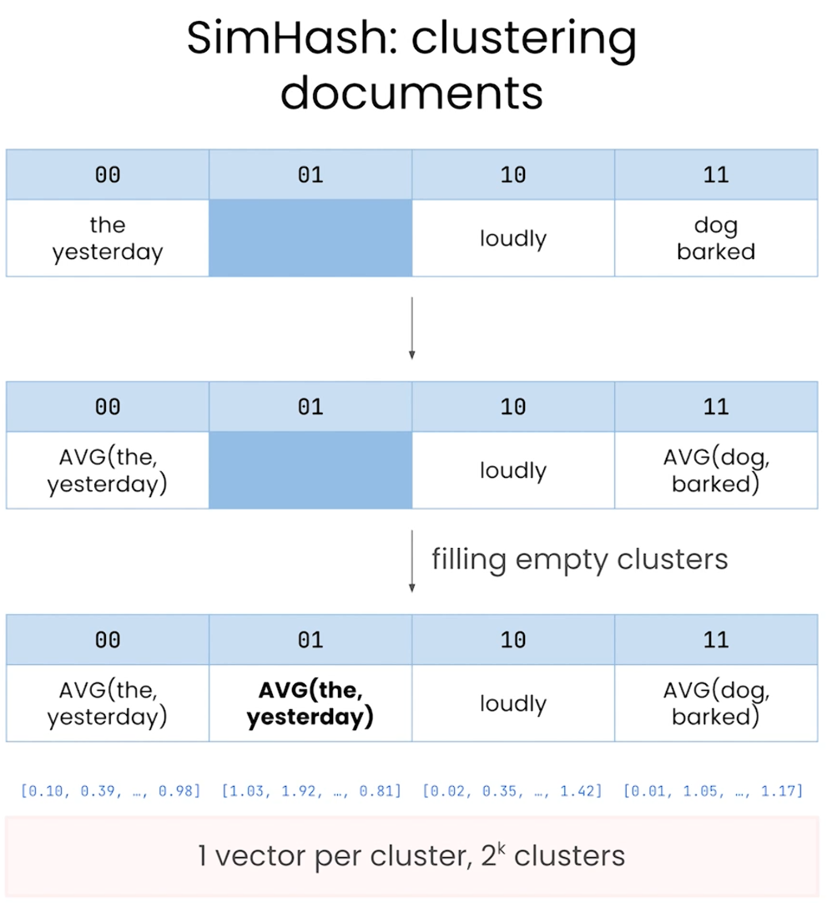

这页课件深入探讨了 **MUVERA** 如何利用 **SimHash** 的原理对文档进行“聚类（Clustering）”，从而将海量的多向量转化为结构化的单向量表示。

这是整个课程中最核心的数学工程实现步骤。我们可以分三步来解读这个流程：

### 1. 第一步：分桶（Assigning to Buckets）

- **对应图表：** 最上方的四个方格（00, 01, 10, 11）。
- **操作：** 基于前一页提到的“随机超平面切分”，文档中的每个词（或图像块）根据其位置被扔进对应的“桶”里。"the" 和 "yesterday" 掉进了 **00** 桶。"loudly" 掉进了 **10** 桶。"dog" 和 "barked" 掉进了 **11** 桶。**01** 桶目前是空的。

### 2. 第二步：桶内聚合（Intra-cluster Averaging）

- **对应图表：** 中间的四个方格。
- **操作：** 为了压缩数据，我们不再保留桶里的每个原始向量，而是对落在同一个桶里的所有向量**取平均值（AVG）**。
- **意义：** 这样处理后，无论一个桶里原来有 1 个还是 100 个词，现在都只剩下 **1 个代表性向量**。这极大地压缩了空间，同时保留了该区域的语义特征。

### 3. 第三步：填充空桶（Filling Empty Clusters）

- **对应图表：** 下方带有加粗字体的方格。
- **挑战：** 算法要求最终输出的表示必须是**固定长度**的。如果某个语义区域（桶）在当前文档中没有内容（如 01 桶），就会出现空缺。
- **操作：** 如图中所示，01 桶通过某种机制（例如从邻近的 00 桶借用，或使用全局默认值）进行了填充。
- **结果：** 确保了无论文档内容如何，最终都会产出 `2^k` 个桶的完整向量序列。

### 4. 最终产出：固定维度嵌入（1 vector per cluster）

- **看最下方：**每个桶现在都有且仅有 **1 个向量**。如果你有 `k` 个超平面，就会有 `2^k` 个桶。**终极转化：** 所有的桶向量按顺序排列，就形成了一个**长长的、但维度固定的单一向量**（即图中那一串 [0.10, 0.39, ...]）。

### 总结：MUVERA 的“炼金术”

这页课件揭示了 MUVERA 是如何完成“多变一”的神技的：

1. **它不是简单的平均：** 传统的单向量模型是把所有词揉在一起求平均，丢了细节。
2. **它是“分区平均”：** 它先按语义把空间分成若干个“房间”（桶），每个房间只对自己的内容求平均。
3. **结果：** 它既拥有单向量的高效（可以直接用 HNSW 检索），又像多向量模型一样保留了“房间与房间之间”的语义差异和细节。

**一句话总结：这页课件展示了 MUVERA 如何通过“先分房、后归纳、再填空”的步骤，将 ColPali 杂乱的多向量序列加工成整齐划一、极速可查的单向量索引。**

## 十六、SimHash：clustering querys

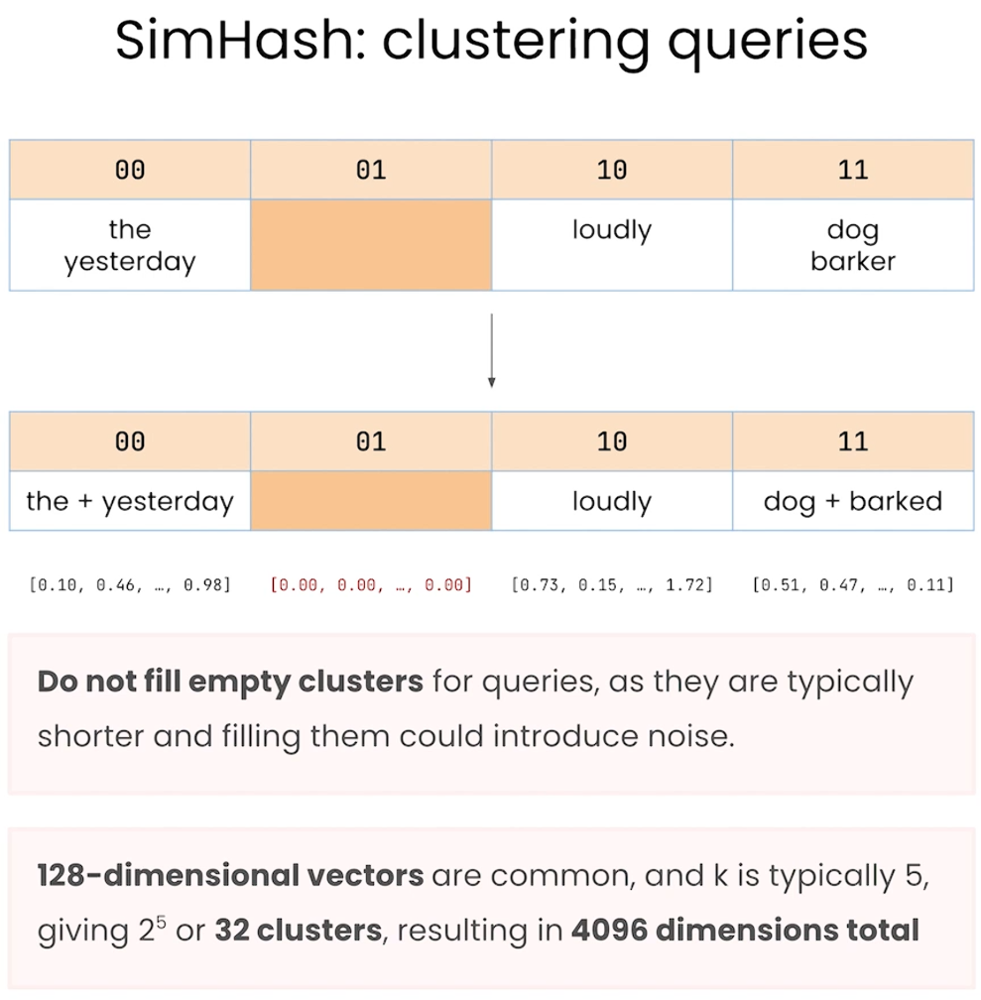

虽然流程看起来与文档处理相似，但为了保证检索的准确性，它在细节处理上有着至关重要的**“非对称性”**策略。以下是详细解读：

### 1. 查询的分桶与聚合 (The Process)

- **分桶：** 同样使用 SimHash 的随机超平面，将查询中的词（Tokens）扔进对应的桶里。"the", "yesterday" `→→` **00** 桶"loudly" `→→` **10** 桶"dog", "barked" `→→` **11** 桶
- **聚合：** 注意图中写的是 the + yesterday。对于查询，通常将落在同一个桶里的向量进行**累加**，而不是简单的平均，以保留查询词的强度信息。

### 2. 核心区别：不填充空桶 (Do not fill empty clusters)

这是本页最重要的知识点，也是与文档处理最大的不同：

- **现象：** 图中 **01** 桶对应的向量全是 **0**（[0.00, 0.00, ..., 0.00]）。
- **原因：**查询通常很短： 用户的问题只有几个词，注定大部分桶是空的。**避免噪音（Noise）：** 在上一页文档处理中，我们会“填充”空桶以创建一个完整的文档画像；但在处理查询时，如果强行填充（例如用默认值或邻近值），会引入与用户意图无关的噪音，导致匹配偏移。
- **结果：** 查询向量是一个**稀疏**的高维向量，只有用户提问涉及到的语义区域才有数值。

### 3. 数学规格：4096 维的由来

课件下方的文字给出了 MUVERA 在工程实现上的典型参数：

- **基础维度：** 每个词的原始向量是 **128 维**。
- **桶的数量：** 典型的超平面数量 `k=5`，产生的桶（Clusters）数量为 `2^5=32` 个。
- **最终总维度：** `128 (维度)×32 (桶)=4096` **维**。
- **意义：** 无论文档还是查询，最后都会变成一个固定的 **4096 维单向量**。这个长度虽然比普通嵌入向量（如 1536 维）长，但它依然是固定长度的，因此可以完美适配 HNSW 等极速检索算法。

### 总结：MUVERA 如何完成最后一步？

通过这两页课件（文档处理 + 查询处理），我们看清了 MUVERA 的全貌：

1. **统一格式：** 它把 ColPali 产生的不定长“多向量序列”变成了定长的 **4096 维“单向量”**。
2. **非对称设计：** 文档向量是“稠密”的（填满了信息），查询向量是“稀疏”的（只保留提问信息）。这种设计确保了搜索时，查询能精准地在文档对应的“语义房间”里找到匹配项。
3. **工业落地：** 这种 4096 维的向量可以直接存入传统的向量数据库，并利用对数级的 HNSW 算法，在毫秒内从亿级海量 PDF 页面中找到你要的那一页。

**一句话总结：这页课件解释了查询端如何通过“留白（不填空桶）”来保持搜索的纯净度，并给出了最终能够实现毫秒级搜索的 4096 维工程标准。**

## 十七、降维技术：随机投影

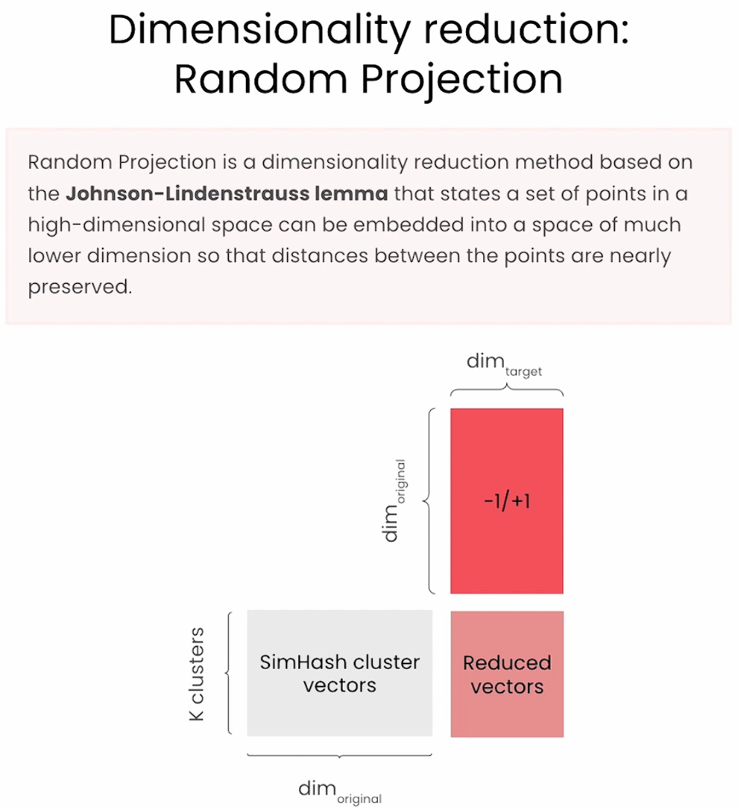

在上一页课件中，我们提到 MUVERA 最终生成了一个 **4096 维**的长向量。虽然这已经可以进行 HNSW 检索，但 4096 维依然比较大，存储和计算成本较高。随机投影的作用就是**在几乎不损失精度的情况下，把这个长向量变得更短、更精简。**

### 1. 核心理论：JL 引理 (Johnson-Lindenstrauss lemma)

课件顶部的文字解释了这项技术的数学基础：

- **引理内容：** 在高维空间中的一组点，可以被嵌入到低维空间中，同时**点与点之间的距离（相似度）几乎保持不变**。
- **直白解释：** 只要目标维度（缩减后的维度）足够，虽然数据变小了，但原来相似的东西在缩减后依然相似。这对于 RAG 检索（寻找最相关的文档）至关重要。

### 2. 图解计算过程 (矩阵相乘)

图中的方块展示了它是如何通过数学运算实现降维的：

- **左侧灰色块 (SimHash cluster vectors)：** 这是原始的高维输入。它有 `K` 个簇（Clusters，例如 32 个）。每个簇的原始维度是 `dimoriginal`（例如 128 维）。
- **上方红色块 (-1/+1)：** 这是**随机投影矩阵**。它的值通常被简化为 **-1 或 +1**。它的列数决定了我们想要降到的目标维度 `dimtarget`。*优点：* 使用 -1 和 +1 可以让计算变得极快，因为在计算机底层这只是加法和减法运算。
- **右下方粉色块 (Reduced vectors)：** 这是降维后的输出。行数（簇的数量 `K`）没变，但每一行的长度（维度）从 `dimoriginal` 缩减到了 `dimtarget`。

### 3. 为什么在 MUVERA 中使用它？

1. **克服“维度灾难”：** 4096 维的索引会占用大量的内存和磁盘空间，搜索速度也会变慢。通过随机投影，可以将其缩减到更合理的范围（如 512 或 1024 维）。
2. **保持检索质量：** 依靠 JL 引理，我们知道降维后的向量依然能代表原始文档的视觉和语义特征，搜索准确率（Precision）下降极小。
3. **计算高效：** 这种投影过程非常简单，不需要像主成分分析（PCA）那样进行复杂的矩阵分解，适合处理海量实时数据。

### 总结：MUVERA 优化全流程

至此，我们看清了 MUVERA 处理文档的完整链路：

1. **ColPali 编码：** 将 PDF 页面变成一大堆 128 维的小向量（多向量表示）。
2. **SimHash 聚类：** 把这些小向量按语义分进 32 个“桶”里，并取平均值（多变一，形成 4096 维长向量）。
3. **随机投影（本页内容）：** 把 4096 维压缩到更精简的维度（例如 512 维）。
4. **HNSW 索引：** 将最终的精简单向量存入数据库，实现毫秒级搜索。

**一句话总结：随机投影是 MUVERA 的“瘦身器”，它利用数学上的“空间折叠”技巧，让海量文档的视觉检索变得既轻量又飞快。**

## 十八、随机投影的高效性和可靠性

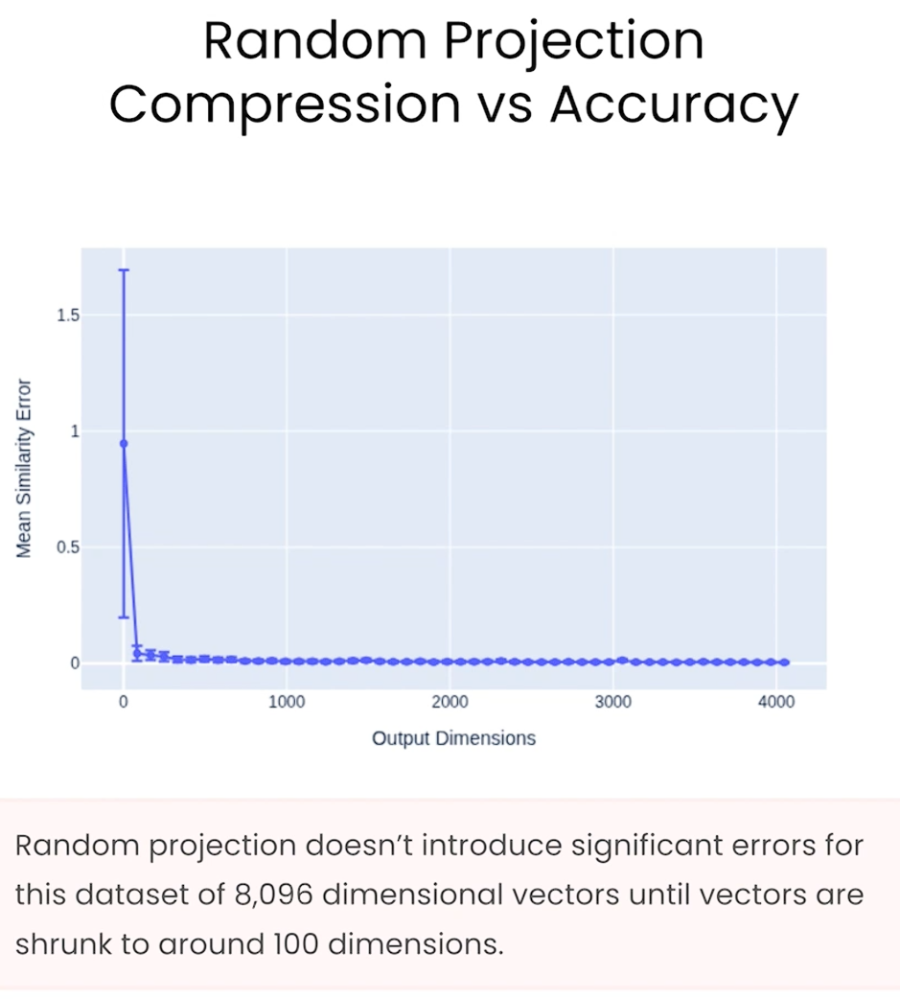

它的核心结论是：**你可以对向量进行极其大胆的压缩，而几乎不会损失检索的准确度。**

以下是详细的解读：

### 1. 图表坐标轴的含义

- **横轴 (Output Dimensions)：** 代表降维后输出的向量维度。最右侧是 4000 维（接近 MUVERA 原始的 4096 维），向左则代表压缩得越来越小。
- **纵轴 (Mean Similarity Error)：** 代表**平均相似度误差**。误差越接近 **0**，说明降维后的向量在搜索时的表现与原始高维向量越一致（即：原来相似的文档，降维后依然能被精准找到）。误差越高，说明检索质量下降越严重。

### 2. 核心观察：惊人的“压缩比”

- **平坦的曲线：** 你可以看到，从 4000 维一直往左降到 500 维、甚至 200 维，蓝色的误差曲线几乎是一条贴着 0 的直线。
- **临界点：** 只有当维度被猛烈压缩到 **100 维以下**时，误差才开始像坐过山车一样急速飙升。
- **结论：** 课件下方的文字指出，对于这个 8096 维（注：这里是以 8096 为例，原理同 MUVERA 的 4096 维）的初始向量集，**只要不压缩到 100 维以下，随机投影几乎不会引入任何明显的误差。**

### 3. 这对工业级 RAG 系统意味着什么？

这页课件给出了一个非常振奋人心的工程结论：

1. **极高的性价比：** 我们可以放心地将 4096 维的 MUVERA 向量压缩到 256 维或 512 维。
2. **空间节省：** 这种压缩可以将存储成本再降低 **8 到 16 倍**。
3. **速度翻倍：** 维度越低，HNSW 索引在内存中占用的空间越小，检索计算的速度就越快。
4. **精度无损：** 这种性能的巨大提升，是以几乎可以忽略不计的精度损失为代价换来的。

### 总结：本系列课件的最终技术路线

如果你把这几页课件连起来看，你会发现作者给出了一个处理海量复杂文档（PDF/图表）的**标准答案**：

- **第一步 (ColPali)：** 用视觉模型“看”文档，生成高精度的多向量序列。
- **第二步 (MUVERA + SimHash)：** 把多向量聚合成分区平均的 4096 维单向量。
- **第三步 (Random Projection)：** 利用本页证明的原理，把 4096 维压缩到 256/512 维。
- **第四步 (HNSW)：** 存入数据库，实现**十亿级文档、毫秒级响应、视觉级精度**的检索。

**一句话总结：这页课件用数据为随机投影技术“背书”，证明了 MUVERA 在处理大规模数据集时，既能瘦身又能保真。**

## 十九、拼接

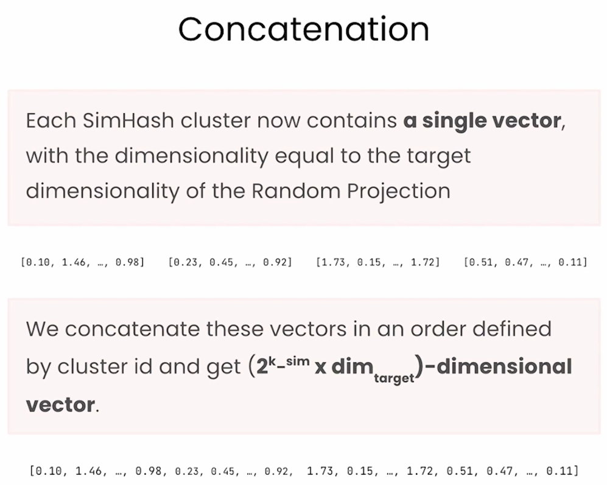

展示了 **MUVERA** 流程中的最后一步：如何将之前处理好的各个“桶”（集群）的向量整合成一个最终的**单一向量**。

我们可以把这一步理解为整个数据加工流水线的“最后组装阶段”。以下是详细解释：

### 1. 现状：每个集群都有一个“瘦身”后的向量

- **课件文字：** “每个 SimHash 集群现在都包含一个**单一向量**，其维度等于随机投影（Random Projection）的目标维度。”
- **解读：**在前面的步骤中，我们先用 **SimHash** 把文档的所有词元分进了不同的“桶”（Clusters）。然后通过 **随机投影**，把每个桶里原本很长（例如 128 维）的向量压缩得更短。**结果：** 现在你手里有一系列排列整齐的短向量（如图中第一行数字序列所示）。

### 2. 组装：按顺序拼接（Concatenate）

- **课件文字：** “我们按照集群 ID 定义的顺序拼接这些向量，得到一个维度为 **(**2^{k_sim}×dim_target**)** 的向量。”
- **解读：**顺序很重要： 我们不是胡乱堆放，而是按照 00, 01, 10, 11... 这种固定的 ID 顺序，把这些短向量头尾相接地“焊”在一起。**维度计算：**假设你有 `2^5=32` 个集群（桶）。每个桶降维后的向量是 16 维。那么拼接后的最终向量就是 `32×16=512` **维**。**视觉表现：** 如图中第二行所示，所有的方括号消失了，变成了一串长长的、连续的数字序列。

### 3. 这一步的战略意义

这是 MUVERA 能够实现“降维打击”的关键收尾工作：

1. **实现“单向量表示”：** 通过这种拼接，我们终于把 ColPali 输出的“一大堆不定量的向量序列”变成了一个**单一的、固定维度的向量**。
2. **保留空间/语义结构：** 因为是按桶 ID 顺序拼接的，向量的每一个段落都代表了原文档在某个特定语义区域的特征。这种结构化的拼接方式让单向量依然保留了多向量模型才有的细节理解力。
3. **完美适配 HNSW：** 只有变成了这种标准的单向量格式，数据才能存入主流的向量数据库（如 Milvus, Pinecone 等），并利用 **HNSW 算法**实现我们之前提到的“对数级”极速检索。

### 总结：MUVERA 技术全链路回顾

通过这十几页课件的学习，我们可以总结出处理复杂 PDF 文档的最新路径：

- **输入：** 复杂的 PDF 页面（含图表、表格）。
- **第一步 (ColPali)：** 像人眼一样看图，提取每个细节的特征（产生一堆向量）。
- **第二步 (SimHash)：** 按语义给特征“分房间”（聚类）。
- **第三步 (Random Projection)：** 给每个房间的信息“抽脂瘦身”（降维）。
- **第四步 (Concatenation - 本页)：** 把所有房间的精简信息按顺序拼成一根长绳（生成最终单向量）。
- **结果：** 这一根“长绳”既包含了 PDF 的所有视觉灵魂，又跑得像普通文字搜索一样快。

**一句话总结：这页课件展示了如何将碎片化的语义特征“打包”成一个标准的单向量，从而完成了从“高端视觉理解”到“大规模工业级检索”的最后跳跃。**

## 二十、重复/多次采样

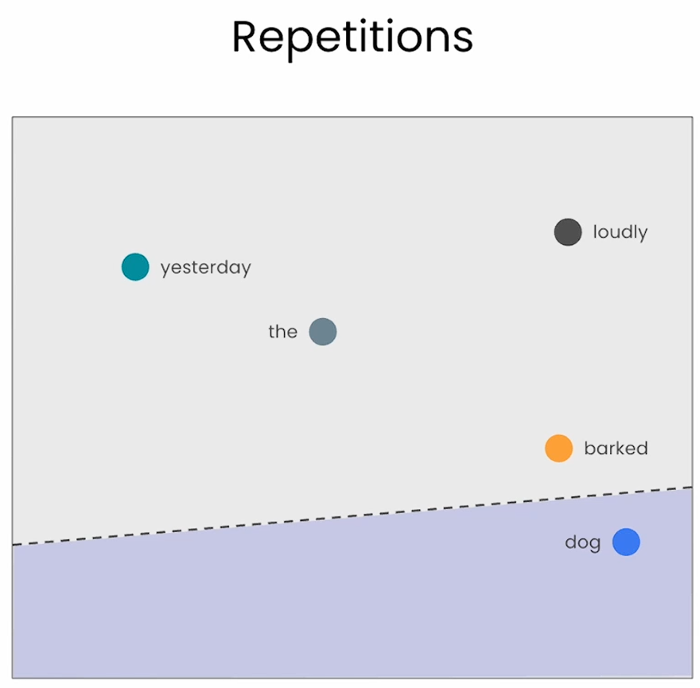

它是对前面提到的 **SimHash** 和 **随机投影** 技术的进一步补充，解释了如何通过“多次随机采样”来解决**边界敏感性**问题，从而提高检索的鲁棒性（稳定性）。

### 1. 发现问题：随机切分的“运气”成分

在前面介绍 SimHash 时，我们提到它是通过“随机超平面”（图中的虚线）来切分空间的。

- **观察图中的点：** 请注意 "barked"（吠叫）和 "dog"（狗）这两个词。
- **语义逻辑：** 在语义空间里，这两个词距离非常近，因为它们经常一起出现，且语义相关。
- **尴尬的现状：** 图中的那条随机虚线**刚好**从它们两个中间穿过。结果导致："barked" 落在了一个区域（灰白色）。"dog" 落在了一个完全不同的区域（紫色）。
- **结果：** 按照之前的逻辑，它们会被分进两个不同的“桶”。在系统看来，这两个本来很像的词，就因为这道线画得“不走运”，变成了完全不相关的内容。这就是所谓的**“边界失效”**。

### 2. 解决方案：Repetitions（多次重复采样）

为了解决这种“随机产生的倒霉边界”问题，MUVERA 等算法引入了 **Repetitions** 机制。

- **核心逻辑：** 既然一套随机线可能会切错，那我们就多搞几套不同的随机线！
- **操作方式：**生成第一组随机线，计算一套 Hash 值。生成第二组、第三组……第 `N` 组完全不同的随机线。
- **为什么有效：** 虽然在第一组线里 "dog" 和 "barked" 被分开了，但在第二组或第三组线里，由于线的角度变了，它们极大概率会重新落在同一个区域里。

### 3. 在 MUVERA 流程中的角色

如果你结合前面的“拼接（Concatenation）”课件看：

- **串联：** 最终生成的那个 4096 维单向量，实际上可能包含了**多次重复采样**后的结果。
- **多重指纹：** 这种做法类似于给文档录入“多组指纹”。即便其中一组指纹因为随机性导致局部失真，其他几组指纹也能修正回来。
- **权衡：** 增加 Repetitions 的次数可以大幅提高检索的**准确率（Recall）**，但代价是向量维度会成倍增加，计算量也会变大。

### 总结：整个 MUVERA 技术栈的“安全带”

这页课件实际上是在讲**工程上的鲁棒性（Robustness）**：

1. **随机性是把双刃剑：** 它让计算变快，但也可能切断原本相近的关系。
2. **大力出奇迹：** 通过“重复多次（Repetitions）”，我们可以用统计学上的概率来对冲掉那点“运气不佳”的随机误差。
3. **最终目的：** 确保当用户搜“小狗”时，系统能稳稳地搜出写着“吠叫”的 PDF 页面，而不至于因为一道随机切分线就错失良机。

**一句话总结：Repetitions 是为了防止 SimHash 的随机切分线“辣手摧花”，通过多次不同角度的采样，确保相近的语义特征永远能被系统识别到。**

## 二十一、核心总结

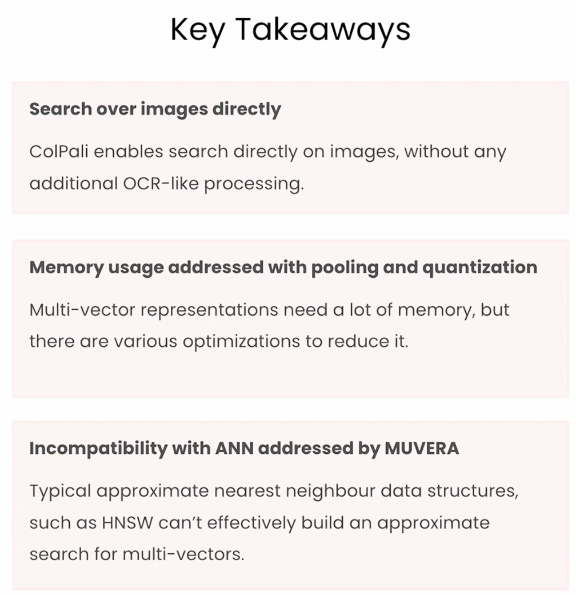

### 1. 突破传统的“解析”束缚：直接视觉搜索 (ColPali)

- **核心信息：** **ColPali** 实现了直接在图像上进行搜索，完全跳过了 OCR（光学字符识别）等预处理步骤。
- **深度解读：**过去： 文档 `→→` OCR 识别 `→→` 版面分析 `→→` 纯文本 `→→` 检索。这个过程极其复杂且容易在 OCR 阶段丢掉表格和图表信息。**现在：** 文档 `→→` 页面截图 `→→` ColPali。模型直接“看”图理解语义。这意味着 PDF 里的复杂排版、统计图、流程图都能被精准搜索到，实现了“所见即所得”。

### 2. 攻克“存储爆炸”难题：池化与量化 (Pooling & Quantization)

- **核心信息：** 多向量表示虽然精准但非常吃内存，可以通过**池化（Pooling）**和**量化（Quantization）**来显著降低开销。
- **深度解读：**痛点： ColPali 这类模型会为页面的每个小块生成一个向量，存储需求是普通模型的几十倍。**对策：**量化： 把 32 位浮点数压缩成 4 位甚至 1 位（二进制），空间瞬间缩小几十倍。**池化（如层级池化）：** 把页面中相似的、冗余的视觉词元合并。**价值：** 只有通过这些优化，昂贵的 ColPali 才能在企业级的大规模数据集上跑起来。

### 3. 抹平“性能鸿沟”：MUVERA 适配 ANN 检索

- **核心信息：** 传统 ANN（近似最近邻）结构（如 HNSW）无法直接处理多向量，而 **MUVERA** 解决了这个问题。
- **深度解读：**技术矛盾： 多向量匹配（Late Interaction）通常需要“暴力搜索”，数据量大时慢得像蜗牛；而工业界最快的 HNSW 索引只支持单向量。**MUVERA 的功劳：** 它通过 SimHash 和 随机投影等技术，巧妙地将“高精度的多向量”浓缩成了“高性能的单向量”。**结果：** 这让视觉检索具备了处理**十亿级数据**并保持**毫秒级响应**的能力。

### 总结：RAG 技术的新范式

这页课件宣告了 RAG 检索正在发生的一场**范式革命**：

1. **从“读文本”转向“看图像”**（解决复杂排版问题）。
2. **从“全量存储”转向“精简压缩”**（解决成本问题）。
3. **从“线性暴力搜索”转向“对数级极速检索”**（解决规模问题）。

**一句话总结：这页课件给出的最终答案是——利用 ColPali 赋予系统“眼睛”，通过 MUVERA 赋予系统“速度”，从而构建出下一代高性能视觉 RAG 系统。**
